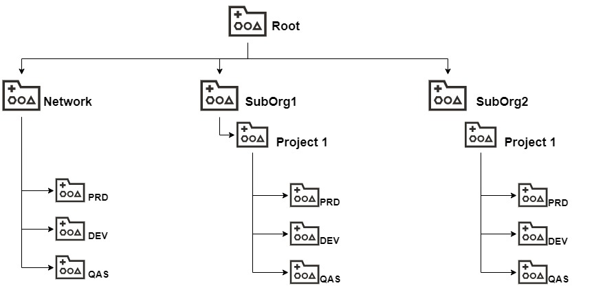

# Identity and Access - Compartment
![version][hoes_compartments]

One of the first construct that need to be created on OCI is the compartment that has the following use cases and usages:
* Logical Organization - Where cloud service resides
* Evaluated in policy - Will be the location portion of Policy.
* Evaluated in constructs that are part of Governance section like:
  * TagDefaults
  * Budgenet
  * Quotas
  * Security Inspection

## Drivers to help in design process
Usgint the information proivided we know that compartments has an important usage here some definitions that can help on how to design.
* First is not definitive you can reorg. 
* Leverage the distinct roles that will perform daily activities:
  * Consume - Here the usage is cross/company wide or dedicated.
  * Environment - Production, Developement, Quality Assurance
  * Teams that will control service life cycle for manage, operate and monitor. Remember small teams are more agile and trnas to be an more flat organization. However, the bigger teams with isolated operation trends to be the opposite.

Now lets move the an practical approache and land this using an example.
Lets assume an company had an fresh new tenancy. In thenancey we have an initial cross service that will be network. This company has smaller teams so our example will me more centralized but will also consider that is important define intially two branches. Named SubOrg1 and SubOrg2, this can be understood  also as divisions departments or other divitions that make sense to yourt business.

<!-- Markdown link & dfns -->
[hoes_compartments]: https://img.shields.io/badge/hoes_compartments-v1.0-brightgreen