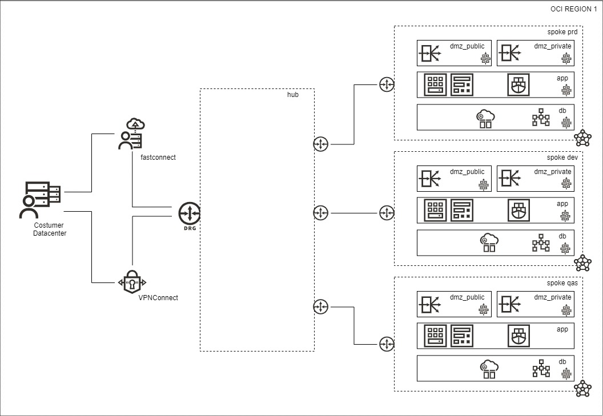

# TAGS

![version][hoes_virtual_networking]

# Overview
One of initial phases of cloud deployment is define the virtual networking. Som aspects are particularly important to avoid unnecessary changes on production in the future.
* VCNs can today receive more than one IPv4 address segments:
* VCNS has regional scope. 
* Use non overlap addresses with existing deployments,
* Avoid assign small segments.
* The virtual constructs here have availability bundle. 
* Consider use Traffic Manager to improve availability and transparency to the workload. Can be also a requirement configure the service to accept alias.
The following virtual constructs bellow helps to define segmentation, and how to control flow and access.
* route tables
* drg
* network security groups
* security lists
* VPNConnect
* peerings gatteways
* service gateway
# Topology

<!-- Markdown link & dfns -->
[hoes_virtual_networking]: https://img.shields.io/badge/hoes_virtual_networking-v1.0-brightgreen